# Mejora del proyecto del servidor 
**BY: Javier Soler Artero, Javier Soler Cantó, Jairo Julià Bravo.**

## Tecnologias utilizadas:

### Docker:
Es un sistema que automatiza el despliegue de aplicaciones dentro de contenedores de software, proporcionando una capa adicional de abstracción y automatización de virtualización de aplicaciones en múltiples sistemas operativos.​
### Docker Compose:
Docker Compose es una herramienta desarrollada para ayudar a definir y compartir aplicaciones de varios contenedores mediante un fichero llamado docker-compose.yml

### Prometheus
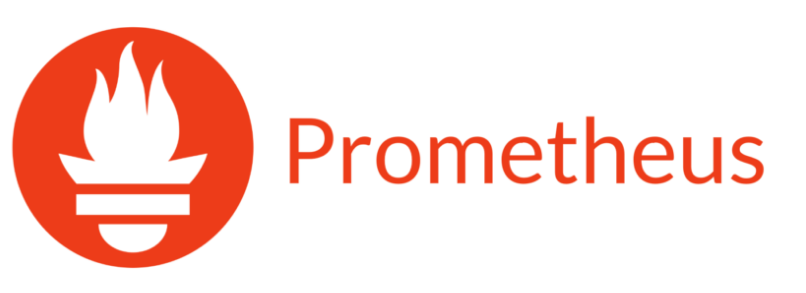 
Prometheus es una aplicación de software gratuita utilizada para la supervisión y alerta de eventos. Registra métricas en tiempo real en una base de datos de series de tiempo construida utilizando un modelo de extracción HTTP, con consultas flexibles y alertas en tiempo real. En la práctica se utilizará para poder tener un seguimiento de las peticiones a los distintos endpoints de la aplicación de nodejs.

### Grafana
 
Es un software que permite la visualización y el formato de datos métricos. Permite crear cuadros de mando y gráficos a partir de múltiples fuentes, incluidas bases de datos de series de tiempo como Graphite, InfluxDB y OpenTSDB.​​ Se ha utilizado esta herramienta para la monitorización gráfica de los datos extraidos por prometheus y poder representarlos de una manera gráfica.

### GO: 
 
Go es un lenguaje de programación concurrente y compilado desarrollado por Google e inspirado en la sintaxis de C, que intenta ser dinámico como Python y con el rendimiento de C o C++. Go es un lenguaje de programación compilado, concurrente, imperativo, estructurado, orientado a objetos y con recolector de basura que de momento es soportado en diferentes tipos de sistemas UNIX, incluidos Linux, FreeBSD, Mac OS X y Plan 9 (puesto que parte del compilador está basado en un trabajo previo sobre el sistema operativo Inferno). Las arquitecturas soportadas son i386, amd64 y ARM.

### Proposito de esta práctica:
La finalidad de esta práctica es la utilización de microservicios para la posterior monitorización de estos y tener un proyecto correctamente escalable, con cada microservicio de forma independiente.

## Microservicios en GO

En esta aplicación, el modelo de negocio del equipo es el desarrollo de una tienda online. Partiendo de esta base el microservicio son productos que los usuarios pueden comprar. De esta manera se ha refactorizado i/o creado nueva funcionalidad:

- Common: con aspectos de configuración globales al microservicio así como utilidades para la creación de sesiones de base de datos
- Models: en donde se definirán los modelos utilizados por el microservicio
- Routers: Para la definición de las rutas o endpoints que publicará el 
microservicio
- Data: En donde se incluyen las funciones que son ejecutadas para obtener la información de respuesta de los endpoints del microservicio
- Controllers: Que incluirá todo lo necesario para que, partiendo de la información de respuesta de las utilidades de la carpeta Data, construirá las respuestas finales de los endpoints del microservicio.

### Cambios
#### Antes:
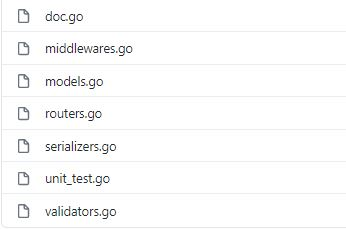

#### Despues:
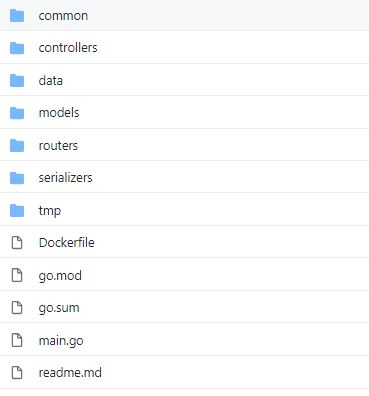

En si los cambios son notables, distribuyendo los ficheros de una forma mas estructurada, clara y escalable. Ahora cada microservicio tendrá su archivo main.go para que se despliegue automaticamente con todas sus dependencias necesarias. 

### main.go:
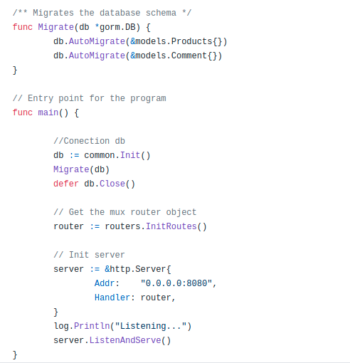

- El main, primeramente al conectarse con la base de datos hará una migración de las entidades de la base de datos. Estas entidades estarán definidas en la carpeta de los modelos del proyecto. Una vez hecha la conexión y las migraciones, se iniciarán las rutas con sus respectivos controladores. Para finalizar se desplegará el servidor en el puerto 8080 de nuestra localhost.

### Common:
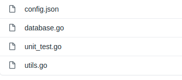

- **database.go:** Aquí estará la configuración de la connexión de la base de datos.

- **utils.go:** El interior de este archivo es para la utilización de herramientas como el display de errores o generar tokens.

### Models:
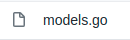

- **model.go:** Definición de todas las entidades del proyecto, en este caso es el de productos y el de todos sus datos relacionados como el autor y los comentarios.

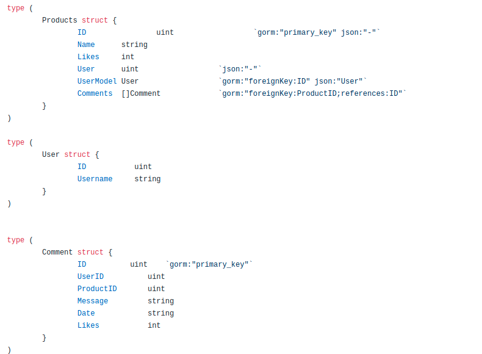

### Routers:

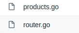

- **router.go:** Inicia las rutas llamando al enrutador de los productos

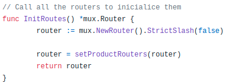

- **products.go:** Inicia las rutas de los productos, en este caso solo hay dos la de obtener todos los productos (/products) o la de obtener solo un producto (/product). Cada una de estas con su respectivo controlador que manejará la petición y devolverá el resultado.

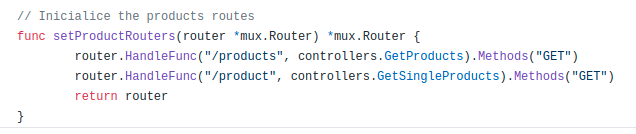

### Data:

- **repositories.go:** Tiene las operaciones con la base de datos para obtener lo resultados de los distintos productos. Estas funciones serán llamadas por los controladores para buscar los datos en la base de datos y crear la respuesta para el usuario que ha hecho la petición.

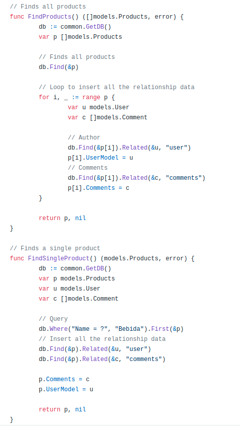

### Controllers:

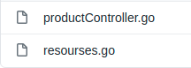

- **productController.go:** Tiene los metodos que controlarán, validarán y responderán las peticiones de los usuarios. En este caso son dos: 

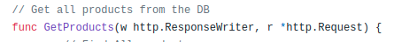
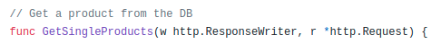

- **resourses.go:** Este archivo es una esopecie de "serializer" pero solo define el tipo de respuesta que tendrá.

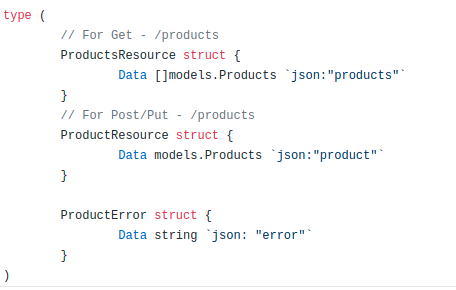

## Extensión de servicios

En este apartado intentaremos crear una plantilla para reutilizar código de nuestro Docker Compose, para ello si utilizamos una versión de docker inferior a la 3 podremos utilizar "**extends**" que básicamente se trata crear un servicio base del cual extenderán los servicios que tengan estas mismas características en común. 

Para versiones de docker compose superiores o igual a 3 podemos utilizar los **campos de extensión**, que se trata de crear una especificación común, que se puede reutilizar para todos los servicios.

La versión de nuestro docker compose es la 3 por lo que hemos optado por los campos de extensión.

Para ello estos campos deben de estar ubicados en la raíz del Compose y su nombre debe empezar por la secuencia `x-` y posteriormente debemos escribir el nombre por el cual llamaremos a este campo, precedido por el signo `&` (**&default-command**).

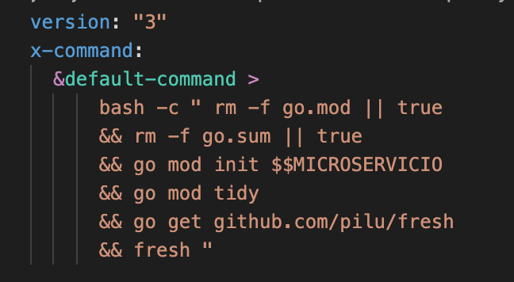

Para utilizar este campo debemos utilizar el singo ´*´ sucedido de el nombre dado anteriormente (*default-command).

Para reutilizar la especificación command tenemos que utilizar una variable de entorno, por que según el servicio debe llamar a un microservicio u otro.

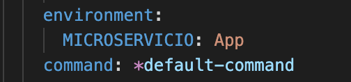

En esta imagen podemos observar como utilizamos el comando y reescribimos el valor de la variable de entrono con el valor **App**.

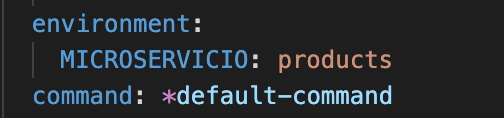

En esta imagen observamos utilizamos el comando con el valor **products**.