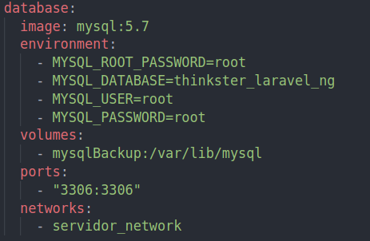
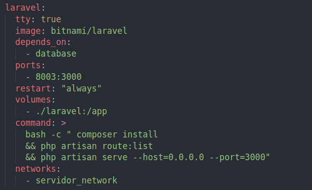
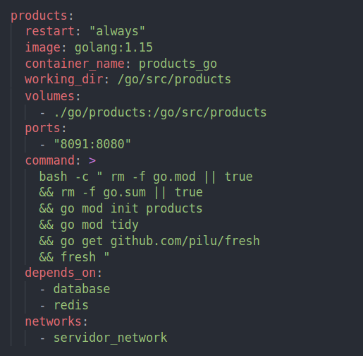
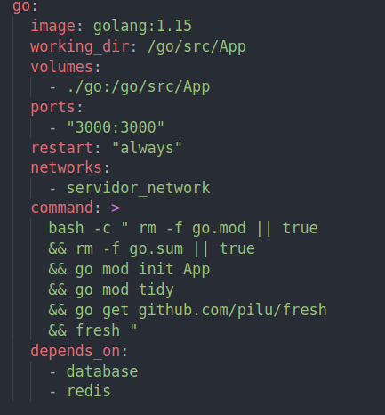
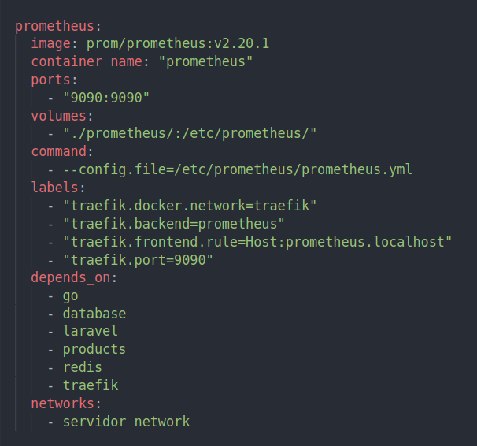
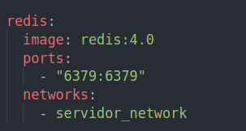
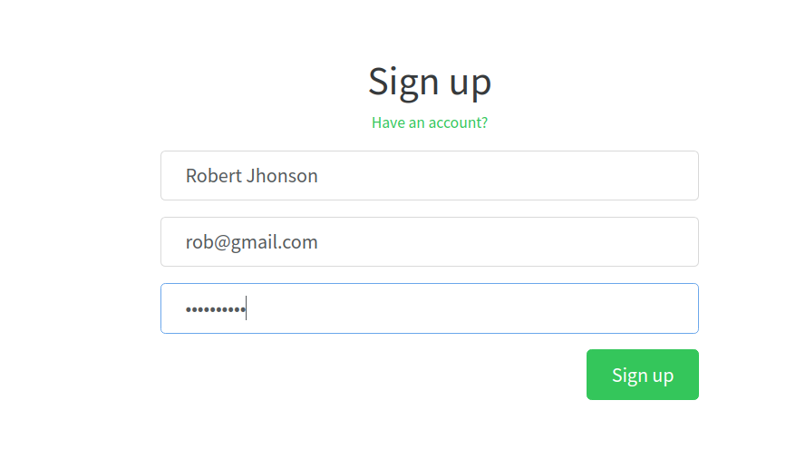
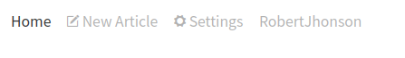
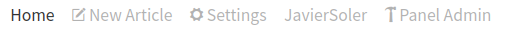
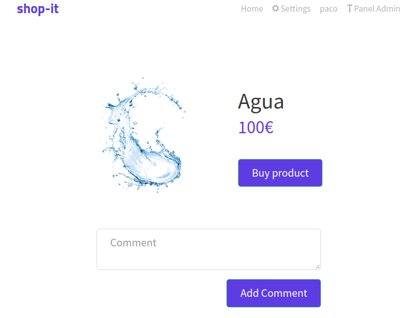

# Laravel + GO + Angular

## Deploy

### Frontend

Run in command line:

`$ cd frontend/`

`$ npm run install`

`$ npm run start`

### Backend

Backend is deployed by a docker compose file inside backend folder

`$ cd backend/`

`$ sudo docker-compose up --build`

- #### Database:

- #### Laravel:

- #### Products Microservice:

- #### Users Microservice:

- #### Prometheus:

- #### redis:

- #### traefik:

### Pages

This is the main page where you can see all the products without being logged.

You can registry and login with a user

Once the user is logged the header will be updated

If the user has enought provileges, he will be admin and will see the "Panel Admin" screen.

This is the product's page where all the info of it will be displayed. 

Also the users can publish comments to a single product